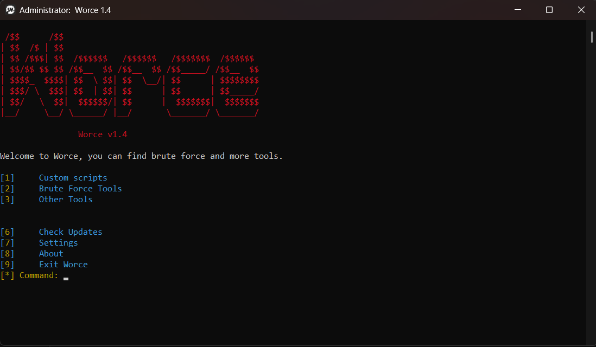

# Worce

This project is closed-source.

Worce is a tool designed to perform brute force attacks on specific file types and networks.

# Features
RAR File Brute Force – Performs brute force attacks on encrypted RAR files.

Wi-Fi Brute Force – Allows brute force testing on wireless networks.

Upcoming Features – Future modules planned for development.

# Requirements
Python 3.x

WinRAR is required for RAR files (on Windows).

Operating System: Preferably Windows (for proper cls command execution in the terminal).

# Installation & Usage
Copy this code and paste to terminal for install and start.
```cmd
git clone https://github.com/Willvinne/Worce
cd Worce
pip install -r requirements.txt
start worce.exe
exit
exit
 ```
Afterwards, you can follow the steps from the Worce terminal interface.

# Disclaimer
Worce is developed for security testing purposes only.

Unauthorized or illegal use is strictly prohibited. The user assumes all responsibility for any consequences arising from the use of this tool.

# License
This project is closed-source and may not be distributed or copied in any way.
